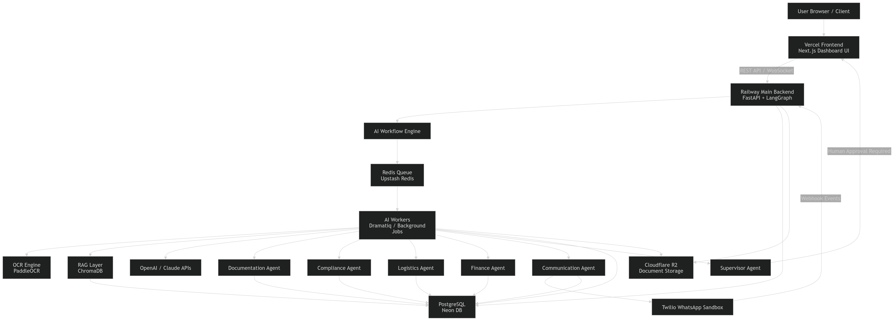
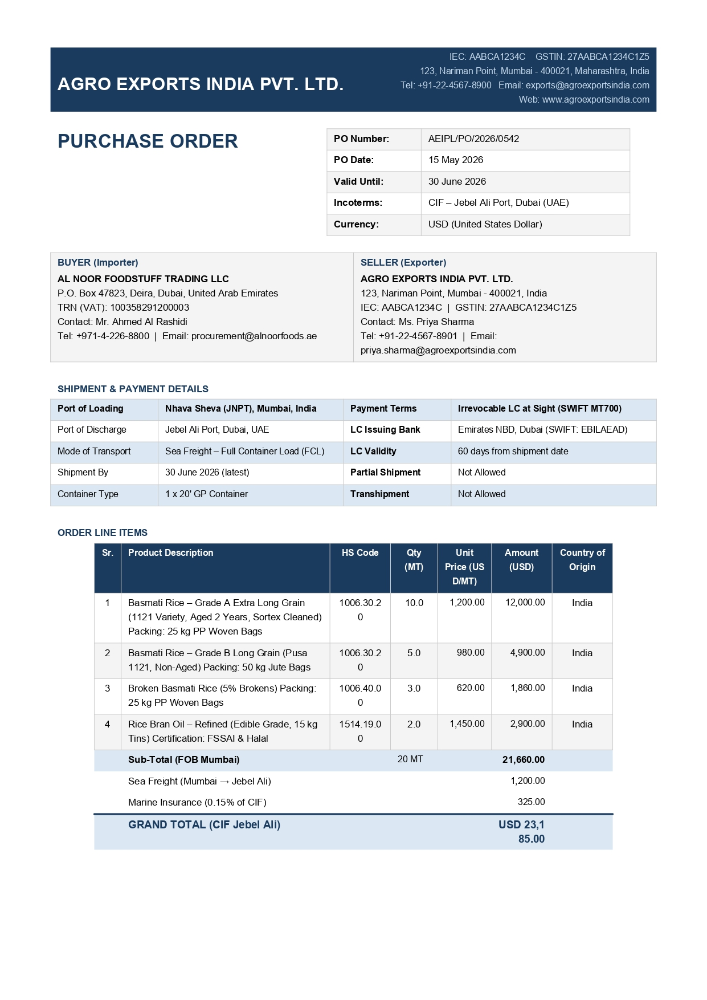

# TradeOS
### Agentic AI Operating System for Export Documentation

> **"AI operates workflows. Humans supervise."**


`TradeOS` replaces manual export documentation, WhatsApp-based operations, and fragmented systems with an autonomous multi-agent AI layer for India–GCC trade corridors. AI agents and employees collaborate from the same projects, conversations, and files, governed centrally and connected to existing enterprise systems.

--------------------------------------------------------------------------------

Hi,

We are building a platform called TradeOS.

TradeOS is an AI operating system specifically designed for export houses, freight forwarders, and logistics SMEs.

Over the last few months, we studied how export companies in India and GCC markets actually operate day to day.

We noticed that most operations still depend heavily on:
• WhatsApp
• emails
• PDFs
• Excel sheets
• manual documentation
• experienced staff memory

And because of this, companies face recurring issues like:
• documentation delays
• repeated data entry
• shipment coordination problems
• dependency on a few experienced employees
• lack of operational visibility
• compliance risks

What we are building is not just another ERP or chatbot.

TradeOS acts like an AI operational workforce layer on top of your existing workflows.

For example:

A customer sends a purchase order through WhatsApp or email.

TradeOS can automatically:
• extract order details
• generate invoices
• create packing lists
• validate compliance requirements
• coordinate shipment workflows
• send customer updates
• track approvals
• maintain operational audit trails

All while your team supervises and approves critical steps.

The idea is not to replace your people.

The idea is to reduce repetitive operational workload so your team can handle more shipments with fewer bottlenecks. Eventually your team will get AI digital employees who will work 24/7 without breaks and will be available for your team members anytime they need help.

Right now we are developing the MVP and working closely with real export and logistics workflows from Kochi and other export-centric cities of India and GCC-countries

At this stage, we are looking for a few operational partners to:
• understand real workflows
• validate pain points
• test automation scenarios
• co-develop practical features

We are not asking you to replace your systems.

Initially, we only want to demonstrate a few practical workflows like:
• AI-assisted documentation
• shipment coordination
• automated customer communication
• workflow tracking

Our long-term vision is to build an AI-native operational platform for export and logistics SMEs across India and GCC markets.

Since your company already handles real operational complexity, your feedback would be extremely valuable for us.

If possible, I’d love to show you a quick demo and understand:
• where your team spends most manual effort
• which documentation processes create delays
• where communication bottlenecks happen
• and how AI can realistically assist your operations.

One documentation executive in a export or freight forwarding company using TradeOS can process 3–5x more shipments.
---

## Architecture Principles



| Principle | Why |
|-----------|-----|
| **LLM-agnostic** | Models change every 6 months. Your moat is workflows + data, not the model. |
| **Deterministic workflow engine** | LLMs are tools called within steps — not orchestrators. |
| **Memory-first** | Agents learn and improve with every transaction. This is the moat. |
| **HITL by design** | Safe autonomy, not full autonomy. Enterprise trust requires human checkpoints. |
| **Event-driven** | Every action emits events. Kafka powers async, auditable, replay-able operations. |
| **Multi-tenant** | Row-level security. Every query is scoped to org_id. |

---

## Project Structure

```
tradeos/
├── services/
│   ├── api/
│   │   └── main.py              ← FastAPI app, all agents, LLM router, WhatsApp
│   ├── agents/                  ← Agent implementations (extend BaseAgent)
│   ├── workflows/               ← Temporal workflow definitions
│   └── integrations/            ← DHL, FedEx, Maersk, Tally, Zoho connectors
│
├── core/
│   ├── db/                      ← SQLAlchemy models + async session
│   ├── workflow_engine.py       ← Deterministic state machine (saga pattern)
│   ├── memory.py                ← Agent memory layer (pgvector)
│   ├── prompt_registry.py       ← Versioned prompt store with fallback chains
│   └── rbac.py                  ← Roles, permissions, approval chains, JWT auth
│
├── 001_core_schema.sql          ← Full PostgreSQL schema (multi-tenant, audit-ready)
│
├── config/                      ← Environment configs per deployment
├── docker-compose.yml           ← Full stack: Postgres+pgvector, Redis, Kafka, Temporal, OCR
└── requirements.txt
```

---

## The Killer Demo Flow

```
WhatsApp PO / PDF Upload
        │
        ▼
┌─────────────────────┐
│  POExtractionAgent  │  ← LLM extracts: buyer, items, HS codes, terms, currency
│  (+ Doc Intelligence│    Arabic/English/Hindi input normalized
│   Engine for PDFs)  │    Confidence scored per field
└─────────┬───────────┘
          │
          ▼
┌─────────────────────┐
│  HSValidationAgent  │  ← Validates each HS code against DGFT, UAE Customs
│                     │    Flags: prohibited goods, CITES, SCOMET, duty rates
└─────────┬───────────┘
          │
          ▼
┌─────────────────────┐
│  DocGenerationAgent │  ← Generates: Commercial Invoice, Packing List
│                     │    LC-compliant fields, SWIFT MT700 alignment
│                     │    Buyer style preferences applied from memory
└─────────┬───────────┘
          │
          ▼
┌─────────────────────┐
│  HITL Orchestrator  │  ← confidence ≥ 75% + no high flags → AUTO APPROVE
│                     │    confidence 65%–74% → soft review (1-minute check)
│                     │    confidence < 65% or critical flag → BLOCK + notify
└─────────┬───────────┘
          │
    ┌─────┴─────┐
    │           │
    ▼           ▼
Auto-approved  Awaiting human
    │           │ (approval_requests table)
    └─────┬─────┘
          │ approved
          ▼
┌─────────────────────┐
│  CommAgent sends    │  ← WhatsApp message to buyer (Arabic or English)
│  invoice + updates  │    Email with PDF attachments
└─────────┬───────────┘
          │
          ▼
┌─────────────────────┐
│  LogisticsAgent     │  ← Creates shipment record, triggers carrier booking
│  activates tracking │    ETA prediction, container updates
└─────────────────────┘
```

**Single API call to run this entire flow:**
```bash
curl -X POST http://localhost:8000/api/v1/workflow/po-to-dispatch \
  -F "po_text=500kg Black Tea to Dubai, LC payment, CIF Jebel Ali" \
  -F "buyer_whatsapp=+971501234567"
```

---

## Quick Start

### 1. Environment
```bash
cp .env.example .env
# Fill in: JWT_SECRET and either Twilio or Meta WhatsApp credentials.
```

The API container loads runtime configuration directly from `.env` via
`docker-compose.yml`, and `Dockerfile.api` includes `.env` in the image build.

For the MVP Twilio WhatsApp path, keep:
```bash
WHATSAPP_PROVIDER=twilio
TWILIO_ACCOUNT_SID=...
TWILIO_AUTH_TOKEN=...
TWILIO_PHONE_NUMBER=whatsapp:+14155238886
```

The direct Meta WhatsApp option remains available with `WHATSAPP_PROVIDER=meta`
and `WHATSAPP_TOKEN` / `WHATSAPP_PHONE_ID`.

For the current Meta business portfolio:
```bash
META_BUSINESS_NAME="AI Agentic OS For Trade"
META_BUSINESS_PORTFOLIO_ID="2841939439484082"
FACEBOOK_BUSINESS_ID="2841939439484082"
```

Keep `WHATSAPP_PHONE_ID` and `WHATSAPP_BUSINESS_ID` from the WhatsApp
Cloud API screen. The business portfolio ID is different from the phone
number ID.

### 2. Start the stack
```bash
docker compose up -d --build api
```

Postgres and Redis use non-default host ports to avoid colliding with services
already running on your machine:

- Postgres: `localhost:5433` -> container `5432`
- Redis: `localhost:6380` -> container `6379`

Override them if needed:
```bash
POSTGRES_HOST_PORT=5432 REDIS_HOST_PORT=6379 docker compose up -d postgres redis
```

### 3. Check services
```bash
docker compose ps
```

### 3.a. Pull Ollama Model If not done already
`docker exec ollama ollama pull qwen2.5:3b`

### 4. Run killer demo
```bash
# Text PO
curl -X POST http://localhost:8000/api/v1/workflow/po-to-dispatch \
  -F "po_text=We need 1000 KG Basmati Rice Grade A, destination Dubai, CIF, USD 1.20/kg, payment by LC"

# PDF upload
curl -X POST http://localhost:8000/api/v1/workflow/po-to-dispatch \
  -F "file=@sample_po.pdf" \
  -F "buyer_whatsapp=+971501234567"
```

### 5. Dev with WhatsApp
```bash
docker compose --profile dev up ngrok
# Twilio webhook URL: https://<ngrok-domain>/api/v1/webhooks/twilio/whatsapp
# Meta webhook URL: https://<ngrok-domain>/api/v1/webhooks/whatsapp
# ngrok http 8000 --url=preindulgent-madonna-reliably.ngrok-free.dev
```

### To Monitor Kafka Streams
```bash
docker exec -it api kafka-console-consumer \
  --bootstrap-server kafka:9092 \
  --topic workflow_events \
  --from-beginning
```
---

## Key API Endpoints

### Workflow
| Method | Path | Description |
|--------|------|-------------|
| POST | `/api/v1/workflow/po-to-dispatch` | **THE killer demo** — full pipeline |
| GET  | `/ws/workflow/{id}` | WebSocket live step updates |

### HITL Approvals
| Method | Path | Description |
|--------|------|-------------|
| GET  | `/api/v1/approvals` | List pending approvals for org |
| POST | `/api/v1/approvals/{id}/action` | Approve / reject / request changes |

### Documents
| Method | Path | Description |
|--------|------|-------------|
| POST | `/api/v1/documents/extract` | Upload any trade doc → AI extraction |
| POST | `/api/v1/documents/generate` | Generate invoice/packing list/COO |

### Compliance
| Method | Path | Description |
|--------|------|-------------|
| POST | `/api/v1/compliance/hs-validate` | Validate HS codes for a route |

### Memory
| Method | Path | Description |
|--------|------|-------------|
| GET  | `/api/v1/memory/search?query=...` | Semantic memory search |
| POST | `/api/v1/memory` | Manually upsert memory |

### WhatsApp
| Method | Path | Description |
|--------|------|-------------|
| GET  | `/api/v1/webhooks/whatsapp` | Verification handshake |
| POST | `/api/v1/webhooks/whatsapp` | Meta inbound message handler |
| POST | `/api/v1/webhooks/twilio/whatsapp` | Twilio inbound message handler |

---

## LLM Provider Chain

Tried in priority order. Automatic fallback on error.

```
1. OpenAI GPT-4o          (priority 1 — speed + tool use)
2. GroqCloud Llama         (priority 2 — fast OpenAI-compatible API)
3. xAI Grok 4.3            (priority 3 — OpenAI-compatible API)
4. Anthropic Claude        (priority 4 — best for long docs)
5. Google Gemini 2.0 Flash (priority 5 — multimodal)
6. Local Ollama/Mistral    (priority 6 — always-on fallback, no API cost)
```

Switch priority or disable providers in `Settings.LLM_CHAIN`. GroqCloud keys usually start with `gsk_` and use `GROQ_API_KEY`; xAI Grok uses `XAI_API_KEY`. **Never hardcode a model.**

---

## Agent Memory — The Moat

Every completed workflow trains the system:

| What agents learn | Scope | Benefits over time |
|-------------------|-------|--------------------|
| Buyer currency / port preferences | Per contact | Zero re-entry across orders |
| Validated HS codes for your catalog | Per product | Faster, more accurate compliance |
| Invoice styles each buyer expects | Per contact | Documents that never get rejected |
| Transit times per carrier + route | Per route | Accurate ETA predictions |
| Compliance rules per HS + country | Per route | Proactive blocking before mistakes |
| Payment behavior / risk signals | Per contact | Finance agent credit alerts |
| Human override patterns | Per org | AI learns from every correction |

---

## HITL Confidence Thresholds

| Confidence | Action |
|------------|--------|
| ≥ 92% + no high flags | Auto-approve, dispatch immediately |
| 70–91% | Flag for optional 30-second human review |
| < 70% | Mandatory human review, workflow blocked |
| Any critical compliance flag | Mandatory review regardless of confidence |

Thresholds configurable per org in settings.

## PO Extraction Agent



### Extracted Markdown

## PURCHASE ORDER


<table border=1 style='margin: auto; word-wrap: break-word;'><tr><td style='text-align: center; word-wrap: break-word;'>PO Number:</td><td style='text-align: center; word-wrap: break-word;'>AEIPL/PO/2026/0542</td></tr><tr><td style='text-align: center; word-wrap: break-word;'>PO Date:</td><td style='text-align: center; word-wrap: break-word;'>15 May 2026</td></tr><tr><td style='text-align: center; word-wrap: break-word;'>Valid Until:</td><td style='text-align: center; word-wrap: break-word;'>30 June 2026</td></tr><tr><td style='text-align: center; word-wrap: break-word;'>Incoterms:</td><td style='text-align: center; word-wrap: break-word;'>CIF – Jebel Ali Port, Dubai (UAE)</td></tr><tr><td style='text-align: center; word-wrap: break-word;'>Currency:</td><td style='text-align: center; word-wrap: break-word;'>USD (United States Dollar)</td></tr></table>


<table border=1 style='margin: auto; word-wrap: break-word;'><tr><td style='text-align: center; word-wrap: break-word;'>BUYER (Importer)</td><td style='text-align: center; word-wrap: break-word;'>SELLER (Exporter)</td></tr><tr><td style='text-align: center; word-wrap: break-word;'>AL NOOR FOODSTUFF TRADING LLC</td><td style='text-align: center; word-wrap: break-word;'>AGRO EXPORTS INDIA PVT. LTD.</td></tr><tr><td style='text-align: center; word-wrap: break-word;'>P.O. Box 47823, Deira, Dubai, United Arab Emirates</td><td style='text-align: center; word-wrap: break-word;'>123, Nariman Point, Mumbai - 400021, India</td></tr><tr><td style='text-align: center; word-wrap: break-word;'>TRN (VAT): 100358291200003</td><td style='text-align: center; word-wrap: break-word;'>IEC: AABCA1234C | GSTIN: 27AABCA1234C1Z5</td></tr><tr><td style='text-align: center; word-wrap: break-word;'>Contact: Mr. Ahmed Al Rashidi</td><td style='text-align: center; word-wrap: break-word;'>Contact: Ms. Priya Sharma</td></tr><tr><td style='text-align: center; word-wrap: break-word;'>Tel: +971-4-226-8800 | Email: procurement@alnoorfoods.ae</td><td style='text-align: center; word-wrap: break-word;'>Tel: +91-22-4567-8901 | Email: priya.sharma@agroexportsindia.com</td></tr></table>

## SHIPMENT & PAYMENT DETAILS


<table border=1 style='margin: auto; word-wrap: break-word;'><tr><td style='text-align: center; word-wrap: break-word;'>Port of Loading</td><td style='text-align: center; word-wrap: break-word;'>Nhava Sheva (JNPT), Mumbai, India</td><td style='text-align: center; word-wrap: break-word;'>Payment Terms</td><td style='text-align: center; word-wrap: break-word;'>Irrevocable LC at Sight (SWIFT MT700)</td></tr><tr><td style='text-align: center; word-wrap: break-word;'>Port of Discharge</td><td style='text-align: center; word-wrap: break-word;'>Jebel Ali Port, Dubai, UAE</td><td style='text-align: center; word-wrap: break-word;'>LC Issuing Bank</td><td style='text-align: center; word-wrap: break-word;'>Emirates NBD, Dubai (SWIFT: EBILAEAD)</td></tr><tr><td style='text-align: center; word-wrap: break-word;'>Mode of Transport</td><td style='text-align: center; word-wrap: break-word;'>Sea Freight - Full Container Load (FCL)</td><td style='text-align: center; word-wrap: break-word;'>LC Validity</td><td style='text-align: center; word-wrap: break-word;'>60 days from shipment date</td></tr><tr><td style='text-align: center; word-wrap: break-word;'>Shipment By</td><td style='text-align: center; word-wrap: break-word;'>30 June 2026 (latest)</td><td style='text-align: center; word-wrap: break-word;'>Partial Shipment</td><td style='text-align: center; word-wrap: break-word;'>Not Allowed</td></tr><tr><td style='text-align: center; word-wrap: break-word;'>Container Type</td><td style='text-align: center; word-wrap: break-word;'>1 x 20&#x27; GP Container</td><td style='text-align: center; word-wrap: break-word;'>Transhipment</td><td style='text-align: center; word-wrap: break-word;'>Not Allowed</td></tr></table>

## ORDER LINE ITEMS


<table border=1 style='margin: auto; word-wrap: break-word;'><tr><td style='text-align: center; word-wrap: break-word;'>Sr.</td><td style='text-align: center; word-wrap: break-word;'>Product Description</td><td style='text-align: center; word-wrap: break-word;'>HS Code</td><td style='text-align: center; word-wrap: break-word;'>Qty (MT)</td><td style='text-align: center; word-wrap: break-word;'>Unit Price (USD)</td><td style='text-align: center; word-wrap: break-word;'>Amount (USD)</td><td style='text-align: center; word-wrap: break-word;'>Country of Origin</td></tr><tr><td style='text-align: center; word-wrap: break-word;'>1</td><td style='text-align: center; word-wrap: break-word;'>Basmati Rice – Grade A Extra Long Grain (1121 Variety, Aged 2 Years, Sortex Cleaned) Packing: 25 kg PP Woven Bags</td><td style='text-align: center; word-wrap: break-word;'>1006.30.20</td><td style='text-align: center; word-wrap: break-word;'>10.0</td><td style='text-align: center; word-wrap: break-word;'>1,200.00</td><td style='text-align: center; word-wrap: break-word;'>12,000.00</td><td style='text-align: center; word-wrap: break-word;'>India</td></tr><tr><td style='text-align: center; word-wrap: break-word;'>2</td><td style='text-align: center; word-wrap: break-word;'>Basmati Rice – Grade B Long Grain (Pusa 1121, Non-Aged) Packing: 50 kg Jute Bags</td><td style='text-align: center; word-wrap: break-word;'>1006.30.20</td><td style='text-align: center; word-wrap: break-word;'>5.0</td><td style='text-align: center; word-wrap: break-word;'>980.00</td><td style='text-align: center; word-wrap: break-word;'>4,900.00</td><td style='text-align: center; word-wrap: break-word;'>India</td></tr><tr><td style='text-align: center; word-wrap: break-word;'>3</td><td style='text-align: center; word-wrap: break-word;'>Broken Basmati Rice (5% Brokens) Packing: 25 kg PP Woven Bags</td><td style='text-align: center; word-wrap: break-word;'>1006.40.00</td><td style='text-align: center; word-wrap: break-word;'>3.0</td><td style='text-align: center; word-wrap: break-word;'>620.00</td><td style='text-align: center; word-wrap: break-word;'>1,860.00</td><td style='text-align: center; word-wrap: break-word;'>India</td></tr><tr><td style='text-align: center; word-wrap: break-word;'>4</td><td style='text-align: center; word-wrap: break-word;'>Rice Bran Oil – Refined (Edible Grade, 15 kg Tins) Certification: FSSAI &amp; Halal</td><td style='text-align: center; word-wrap: break-word;'>1514.19.00</td><td style='text-align: center; word-wrap: break-word;'>2.0</td><td style='text-align: center; word-wrap: break-word;'>1,450.00</td><td style='text-align: center; word-wrap: break-word;'>2,900.00</td><td style='text-align: center; word-wrap: break-word;'>India</td></tr><tr><td style='text-align: center; word-wrap: break-word;'></td><td style='text-align: center; word-wrap: break-word;'>Sub-Total (FOB Mumbai)</td><td colspan="3">20 MT</td><td style='text-align: center; word-wrap: break-word;'>21,660.00</td><td style='text-align: center; word-wrap: break-word;'></td></tr><tr><td style='text-align: center; word-wrap: break-word;'></td><td style='text-align: center; word-wrap: break-word;'>Sea Freight (Mumbai → Jebel Ali)</td><td style='text-align: center; word-wrap: break-word;'></td><td style='text-align: center; word-wrap: break-word;'></td><td style='text-align: center; word-wrap: break-word;'></td><td style='text-align: center; word-wrap: break-word;'>1,200.00</td><td style='text-align: center; word-wrap: break-word;'></td></tr><tr><td style='text-align: center; word-wrap: break-word;'></td><td style='text-align: center; word-wrap: break-word;'>Marine Insurance (0.15% of CIF)</td><td style='text-align: center; word-wrap: break-word;'></td><td style='text-align: center; word-wrap: break-word;'></td><td style='text-align: center; word-wrap: break-word;'></td><td style='text-align: center; word-wrap: break-word;'>325.00</td><td style='text-align: center; word-wrap: break-word;'></td></tr><tr><td style='text-align: center; word-wrap: break-word;'></td><td style='text-align: center; word-wrap: break-word;'>GRAND TOTAL (CIF Jebel Ali)</td><td style='text-align: center; word-wrap: break-word;'></td><td style='text-align: center; word-wrap: break-word;'></td><td style='text-align: center; word-wrap: break-word;'></td><td style='text-align: center; word-wrap: break-word;'>USD 23,185.00</td><td style='text-align: center; word-wrap: break-word;'></td></tr></table>

---

## Roadmap

| Phase | Timeline | Deliverables |
|-------|----------|-------------|
| **1 — MVP** | Q1 2025 | WhatsApp intake, Invoice + Packing List, HS validation, HITL, tracking dashboard |
| **2 — Full Agents** | Q2 2025 | All 6 agents, Compliance + Finance live, Tally/Zoho ERP, Certificate of Origin |
| **3 — GCC Expansion** | Q3 2025 | Arabic docs, Saudi/Qatar/Oman corridors, VAT workflows, multi-language portal |
| **4 — Enterprise** | Q4 2025 | SAP integration, multi-company, delay prediction, revenue intelligence, RBAC teams |
| **5 — AI OS** | 2026+ | Conversational ERP, browser-only terminals, autonomous export operations |

---

## Long-Term Vision

> **"AI-Native Cloud Operating Infrastructure for Global Trade SMEs"**

- **AI Workforce Terminals** — role-specific AI interfaces, zero local software
- **Browser-Only Employee Systems** — device becomes a thin terminal
- **Autonomous Export Operations** — PO to delivery without human touch (except exceptions)
- **Conversational ERP Replacement** — natural language is the interface
- **AI-Managed Business Execution Layer** — AI briefs humans, not the other way around

---

## Tech Stack

| Layer | Technology |
|-------|-----------|
| API | FastAPI + uvicorn (async) |
| DB | PostgreSQL 16 + pgvector |
| Cache | Redis |
| Events | Kafka |
| Workflow | Temporal (durable execution) |
| OCR | PaddleOCR + Azure Document Intelligence |
| LLMs | OpenAI → Anthropic → Gemini → Ollama |
| Embeddings | sentence-transformers / OpenAI ada-002 |
| Auth | JWT + RBAC (custom, no external IdP dependency) |
| Storage | S3 / GCS |
| Frontend | Next.js + React (separate repo) |
| Observability | OpenTelemetry + Prometheus |

---

*Built for India–GCC trade. Extensible to any corridor.*  
*Target: replace 50% of manual doc workload in Phase 1. Replace the ERP by 2026.*
